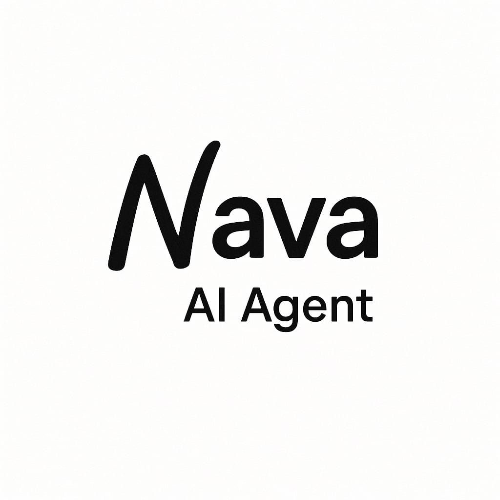
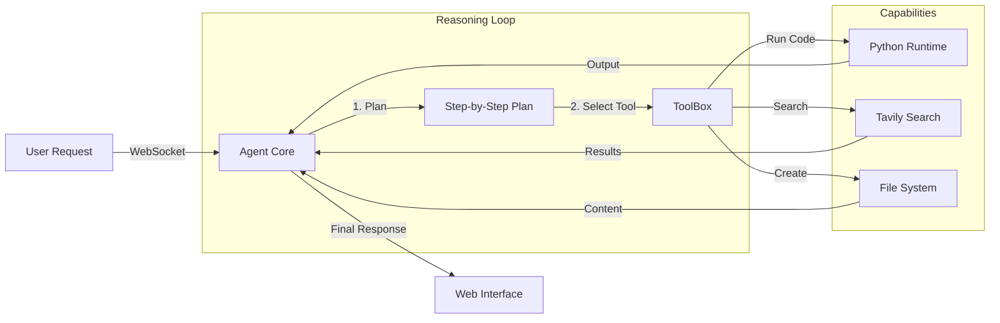

<div align="center">
  

  # Nava AI
  ### The Next-Gen Autonomous Agent Platform

  <p align="center">
    <b>Build. Deploy. Automate.</b>
  </p>

  <!-- Badge Wall -->
  <p>
    
    
    
    
  </p>

  <p align="center">
    <i>A robust full-stack solution bridging the gap between chat interfaces and real-world task automation.</i>
  </p>
</div>

<br>

## 🚀 Why Nava AI?

**Nava AI** isn't just another chatbot. It's a configured **agentic runtime** that gives LLMs hands and eyes.

*   **⚡ Real-World Action**: Unlike standard chat, Nava can edit files, run Python code, and generate documents.
*   **🛡️ Secure Sandbox**: Every action happens in a controlled workspace, keeping your host system safe.
*   **🧠 Tool-Use First**: Built from the ground up for "Reasoning Models" (like GPT-4o and Claude 3.5) that plan before they act.

---

## ✨ Capabilities Grid

| **💻 Coding & Logic** | **🖼️ Creative Suite** | **⚡ Productivity** |
| :--- | :--- | :--- |
| **Python Sandbox**<br>Executes logic, math, and data analysis in real-time. | **Image Generation**<br>Creates stunning visuals on command. | **Web Search**<br>Tavily-powered deep research and answers. |
| **Jupyter Notebooks**<br>Auto-generates and runs notebooks for data science. | **Presentation**<br>Builds professional PPTX slide decks instantly. | **Doc Generator**<br>Compiles reports into PDF, DOCX, and Excel. |
| **File Ops**<br>Safe read/write access to a dedicated workspace. | **HTML Preview**<br>Live-renders generated web apps. | **Session Summary**<br>Auto-notes on what was accomplished. |

---

## 🧠 How it Works

Nava AI operates on a **Plan-Execute-Observe** loop, ensuring high reliability for complex tasks.



---

## �️ Installation

Get up and running in minutes. We recommend **Python 3.12+** and **Node.js 18+**.

<details open>
<summary><b>1️⃣ Backend Setup (The Brain)</b></summary>

```bash
# Clone the repo
git clone https://github.com/shanmuka7482/Open-Manus
cd OpenManus/backend

# Create environment (Using uv is recommended for speed)
curl -LsSf https://astral.sh/uv/install.sh | sh
uv venv --python 3.12
source .venv/bin/activate  # Windows: .venv\Scripts\activate
uv pip install -r requirements.txt

# Configure API Keys
cp config/config.example.toml config/config.toml
# ⚠️ Edit config.toml: Insert your OpenAI/Anthropic and Tavily keys!

# Start Server
python start_server.py
```
</details>

<details>
<summary><b>2️⃣ Frontend Setup (The Interface)</b></summary>

```bash
# Open a new terminal
cd frontend

# Install & Config
npm install
echo "VITE_CLERK_PUBLISHABLE_KEY=your_clerk_publishable_key" > .env

# Run Dev Server
npm run dev
```
</details>

<details>
<summary><b>3️⃣ Proxy Setup (The Bridge)</b></summary>

```bash
# Open a third terminal
cd frontend/server
npm install
node index.js
```
</details>

---

## 🎮 Usage Examples

Once running at `http://localhost:5173`, try these prompts to test Nava's full range:

#### 📊 Data Analysis
> *"Read `sales_data.csv` (I'll upload it), analyze the trends using Pandas, and plot a chart in a Jupyter Notebook."*

#### 📝 Research & Reporting
> *"Research the top 5 competitors to Spotify. Write a comprehensive comparison report and save it as `competitors.pdf`."*

#### 🎨 Creative Design
> *"Generate a slide deck for a startup pitch about 'AI for Cats'. Make it 5 slides long and use a professional theme."*

---

## 📦 Tech Stack

<div align="center">

| **Frontend** | **Backend** |
| :--- | :--- |
|  |  |
|  |  |
|  |  |
|  |  |

</div>

---

## 🤝 Contributing

We welcome contributions! Please fork the repository and submit a Pull Request.

---

## 📝 License

Distributed under the MIT License. See `LICENSE` for more information.

<br>
<div align="center">
  <p>Made with ❤️ by the <b>Nava AI Team</b></p>
  <p><i>Built on top of <a href="https://github.com/mannaandpoem/OpenManus">OpenManus</a></i></p>
</div>
