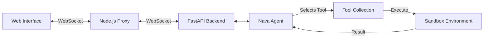

<div align="center">
  

  # Nava AI
  ### The Next-Gen AI Agent Platform

  <p align="center">
    <b>Build. Deploy. Automate.</b><br>
    A full-stack solution for creating intelligent, autonomous agents with a premium web interface.
  </p>
</div>

---

## ⚡ Overview

**Nava AI** is a powerful autonomous agent platform that combines a robust Python backend with a sleek React frontend. It allows you to run a highly capable AI agent that can write code, analyze data, generate documents, and search the web—all within a secure, sandboxed environment.

Designed for developers and power users, **Nava AI** bridges the gap between chat interfaces and real-world task automation.

---

## ✨ Key Capabilities

| **Core Skills** | **Creative & Data** | **Productivity** |
| :--- | :--- | :--- |
| 🐍 **Python Execution**<br>Sandboxed code running for logic & math | 🖼️ **Image Generation**<br>Create AI images on demand | � **Document Generator**<br>Create PDF, DOCX, & Excel files |
| 🌐 **Smart Web Search**<br>Powered by Tavily for real-time answers | � **Jupyter Notebooks**<br>Interactive data analysis & plotting | 🗣️ **Human-in-the-Loop**<br>Asks for clarification when needed |
| �️ **File Operations**<br>Read, write, and patch files safely | �️ **Presentation Mode**<br>Generate professional PPTX slides | � **Session Summaries**<br>Auto-summarizes completed tasks |

---

## 🏗️ Architecture

Nava AI uses a modular "Tool-Use" architecture where the agent thinks, plans, and selects the right tool for the job.



#### Directory Structure
*   `frontend/` - **React Application** (Vite, Radix UI)
*   `backend/` - **Python Environment** (FastAPI, LangChain)
*   `backend/workspace/` - **Sandboxed Area** where the agent creates your files

---

## 🚀 Quick Start Guide

### 1. Backend Setup

```bash
# Clone the repo
git clone https://github.com/mannaandpoem/OpenManus.git
cd OpenManus/backend

# Create environment (Python 3.12 Recommended)
# Using uv (faster):
curl -LsSf https://astral.sh/uv/install.sh | sh
uv venv --python 3.12
source .venv/bin/activate  # Windows: .venv\Scripts\activate
uv pip install -r requirements.txt

# Configure API Keys
cp config/config.example.toml config/config.toml
# Edit config.toml: Add your OpenAI/Anthropic and Tavily keys!

# Start Server
python start_server.py
```

### 2. Frontend Setup

```bash
# In a new terminal
cd frontend

# Install Dependencies
npm install

# Configure Auth (Clerk)
echo "VITE_CLERK_PUBLISHABLE_KEY=your_clerk_key" > .env

# Start UI
npm run dev
```

### 3. Proxy Setup (Required for WebSocket)

```bash
# In a third terminal
cd frontend/server
npm install
node index.js
```

---

## 🎮 How to Use

1.  Open **`http://localhost:5173`** in your browser.
2.  **Login** to access your secure workspace.
3.  Go to the **Sandbox** and start typing!

### Example Prompts
> *"Research the current state of Quantum Computing and write a 2-page PDF report"*

> *"Read the 'sales.csv' file in the workspace and plot the monthly revenue using a Jupyter Notebook"*

> *"Create a slide deck about 'The Future of AI' with 5 slides"*

---

## 📦 Tech Stack

<div align="center">

| **Frontend** | **Backend** |
| :--- | :--- |
|  |  |
|  |  |
|  |  |
|  |  |

</div>

---

## 🤝 Contributing

We love builders! To contribute:
1.  Fork the repo
2.  Create your feature branch (`git checkout -b feature/AmazingThing`)
3.  Commit changes (`git commit -m 'Add AmazingThing'`)
4.  Push to branch (`git push origin feature/AmazingThing`)
5.  Open a Pull Request

---

## 📝 License

Distributed under the MIT License. See `LICENSE` for more information.

<br>
<div align="center">
  <p>Made with ❤️ by the <b>Nava AI Team</b></p>
</div>
