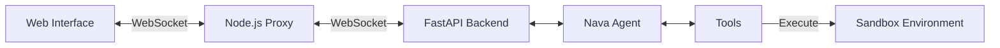

<div align="center">
  

  # Nava AI
  ### The Next-Gen AI Agent Platform

  <p align="center">
    <b>Build. Deploy. Automate.</b><br>
    A full-stack solution for creating intelligent, autonomous agents with a premium web interface.
  </p>
</div>

---

## ⚡ Overview

**Nava AI** bridges the gap between powerful Python-based AI logic and modern React frontends. It is designed for developers who need a production-ready environment for:
*   **Conversational Agents** that can see, hear, and act.
*   **Task Automation** spanning file systems, browsers, and APIs.
*   **Interactive AI Experiences** with real-time feedback and visualization.

---

## ✨ Key Features

| **Core Capabilities** | **Frontend Experience** | **Backend Power** |
| :--- | :--- | :--- |
| 🧠 **Multi-Tool Agents**<br>Python execution, web browsing, file editing | 🎨 **Modern UI**<br>React 18 + TypeScript + Tailwind CSS | 🚀 **FastAPI Server**<br>High-performance async architecture |
| 🛠️ **Sandbox Environment**<br>Safe, real-time code execution | 🌓 **Theming**<br>Dark/Light mode support | 🔌 **MCP Support**<br>Model Context Protocol integration |
| 🗣️ **Human-in-the-Loop**<br>Interactive user input & feedback | 📄 **Smart Viewers**<br>Live preview for HTML, Images, & Code | 🤖 **LLM Flexibility**<br>OpenAI, Azure, Bedrock, & more |
| 📂 **Workspace Manager**<br>Full file system control | 🔐 **Secure Auth**<br>Integrated Clerk authentication | 🕷️ **Browser Automation**<br>Headless Playwright control |

---

## 🏗️ Architecture

Nava AI uses a clean, separated architecture to ensure scalability and maintainability.



#### Directory Structure
*   `frontend/` - **React Application** (Vite, Radix UI)
*   `backend/` - **Python Environment** (FastAPI, LangChain)
*   `backend/workspace/` - **Sandboxed Area** for agent outputs

---

## 🚀 Quick Start Guide

### 1. Backend Setup (The Brain)

```bash
# Clone the repo
git clone https://github.com/mannaandpoem/OpenManus.git
cd OpenManus/backend

# Create environment (Python 3.12+)
python -m venv .venv
source .venv/bin/activate  # Windows: .venv\Scripts\activate

# Install dependencies
pip install -r requirements.txt
playwright install

# Configure
cp config/config.example.toml config/config.toml
# (Add your API keys to config.toml)

# Start Server
python start_server.py
```

### 2. Frontend Setup (The Face)

```bash
# In a new terminal
cd frontend

# Install & Configure
npm install
echo "VITE_CLERK_PUBLISHABLE_KEY=your_key_here" > .env

# Start UI
npm run dev
```

### 3. Proxy Setup (The Bridge)

```bash
# In a third terminal
cd frontend/server
npm install
node index.js
```

---

## 🎮 How to Use

1.  Open **`http://localhost:5173`** in your browser.
2.  **Login** to access your secure workspace.
3.  Go to the **Sandbox** and start typing!

### Example Prompts
> *"Create a snake game in Python and save it as game.py"*

> *"Research the latest AI trends and generate a summary report in Markdown"*

> *"Ask me for my budget, then create a travel itinerary for Japan"*

---

## � Tech Stack

<div align="center">

| **Frontend** | **Backend** |
| :--- | :--- |
|  |  |
|  |  |
|  |  |
|  |  |

</div>

---

## 🤝 Contributing

We love builders! To contribute:
1.  Fork the repo
2.  Create your feature branch (`git checkout -b feature/AmazingThing`)
3.  Commit changes (`git commit -m 'Add AmazingThing'`)
4.  Push to branch (`git push origin feature/AmazingThing`)
5.  Open a Pull Request

---

## 📝 License

Distributed under the MIT License. See `LICENSE` for more information.

<br>
<div align="center">
  <p>Made with ❤️ by the <b>Nava AI Team</b></p>
</div>
